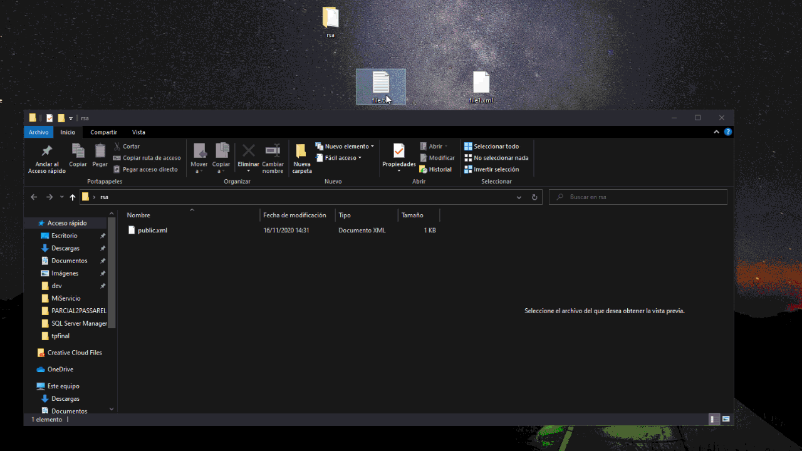

# Parcial Passarelli Bruno
## RSA windows cryptography service 

rsa es un sistema criptográfico de clave pública desarrollado en 1979. Es el primer y más utilizado algoritmo de este tipo y es válido tanto para cifrar como para firmar digitalmente.

La seguridad de este algoritmo radica en el problema de la factorización de números enteros. Los mensajes enviados se representan mediante números, y el funcionamiento se basa en el producto, conocido, de dos números primos grandes elegidos al azar y mantenidos en secreto. Actualmente estos primos son del orden de 10^300, y se prevee que su tamaño siempre crezca con el aumento de la capacidad de cálculo de los ordenadores.

Como en todo sistema de clave pública, cada usuario posee dos claves de cifrado: una pública y otra privada. Cuando se quiere enviar un mensaje, el emisor busca la clave pública del receptor, cifra su mensaje con esa clave, y una vez que el mensaje cifrado llega al receptor, este se ocupa de descifrarlo usando su clave privada.

fuente: https://es.wikipedia.org/wiki/RSA

## DSS


## 🚀 Empezando 🚀! 

#### El servicio, cuando es iniciado, genera una carpeta en un path determinado, preferentemente el desktop.
#### Para trabajar con el, simplemente se arrastra un archivo de nombre estricto "file.xml" con 2 valores, lo que se espera realizar (encrypt || decrypt) y el texto

### Encriptar texto plano
```xml
<file>
  <type>
    encrypt
  </type>
  <text>
    soy un ejemplo
  </text>
</file>
```

#### output: 113,62,201,53,124,150,136,41,114,7,13,225,246,117,206,124,37,206,51,51,61,116,59,218,177,213,147,181,19,139,85,228,216,238,10,146,38,17,90,143,235,50,234,206,124,14,162,183,49,212,123,129,23,190,85,61,175,131,130,23,223,255,21,123,247,169,14,29,64,24,211,155,196,190,158,9,106,120,32,8,226,65,100,122,153,163,249,13,246,155,44,35,70,105,237,7,17,157,33,100,191,241,193,179,231,242,218,28,42,109,249,42,155,165,218,52,199,188,88,114,249,166,118,151,63,123,96,255


### Ejemplo de encriptación (gif): 



### Desencriptar RSA
```xml
<file>
  <type>
    encrypt
  </type>
  <text>    
    113,62,201,53,124,150,136,41,114,7,13,225,246,117,206,124,37,206,51,51,61,116,59,218,177,213,147,181,19,139,85,228,216,238,10,146,38,17,90,143,235,50,234,206,124,14,162,183,49,212,123,129,23,190,85,61,175,131,130,23,223,255,21,123,247,169,14,29,64,24,211,155,196,190,158,9,106,120,32,8,226,65,100,122,153,163,249,13,246,155,44,35,70,105,237,7,17,157,33,100,191,241,193,179,231,242,218,28,42,109,249,42,155,165,218,52,199,188,88,114,249,166,118,151,63,123,96,255
  </text>
</file>
```
#### output: soy un ejemplo


## Author ✒️

* **Bruno Passarelli** - [brunopass](https://github.com/brunopass)
